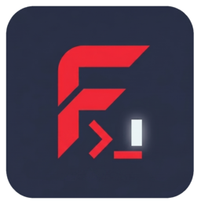
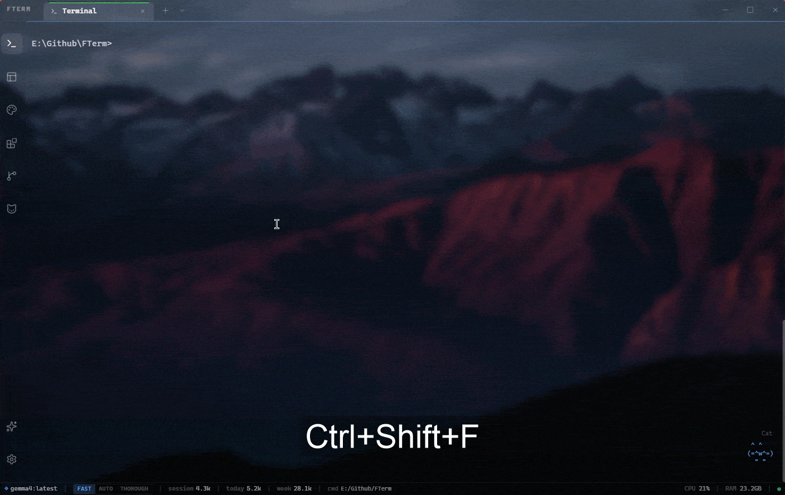
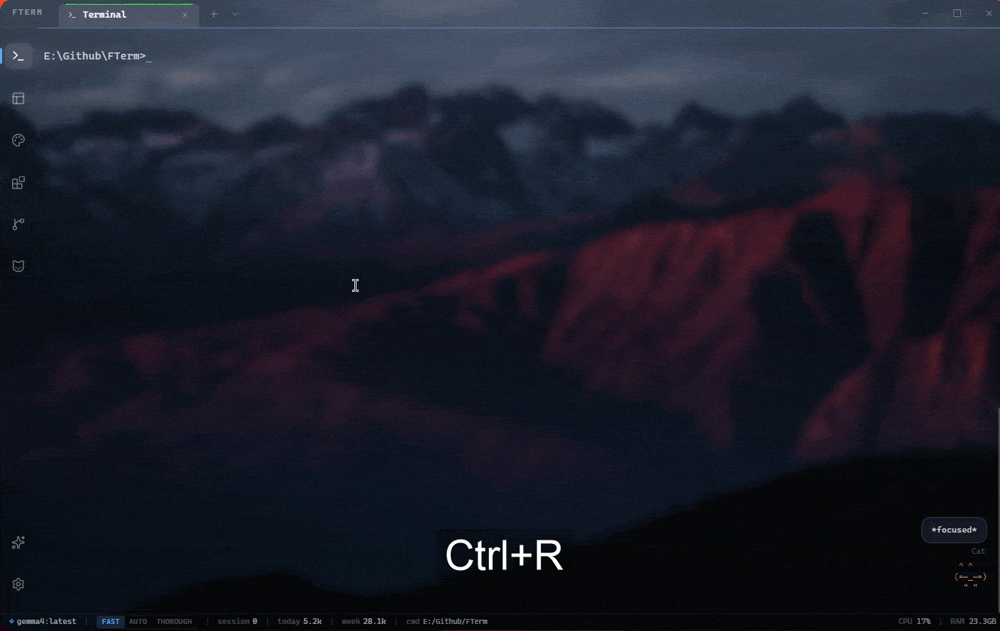
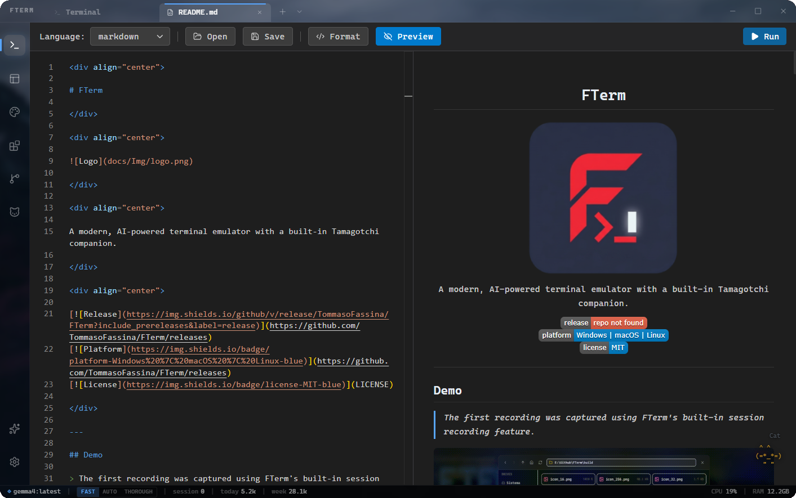
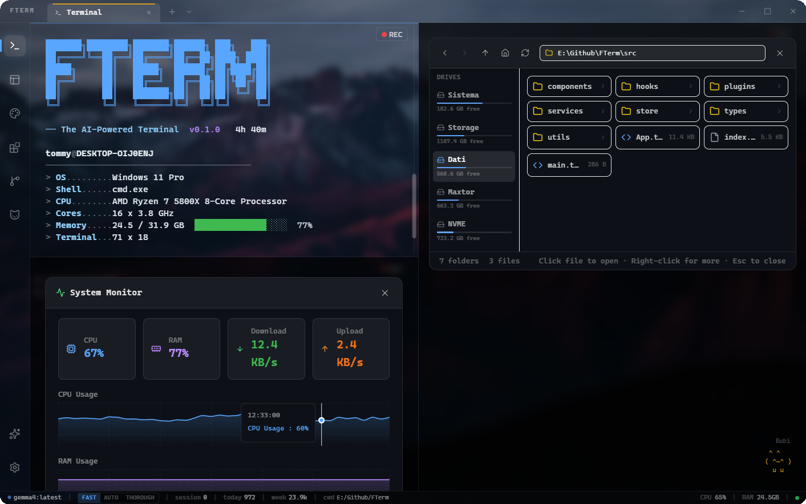
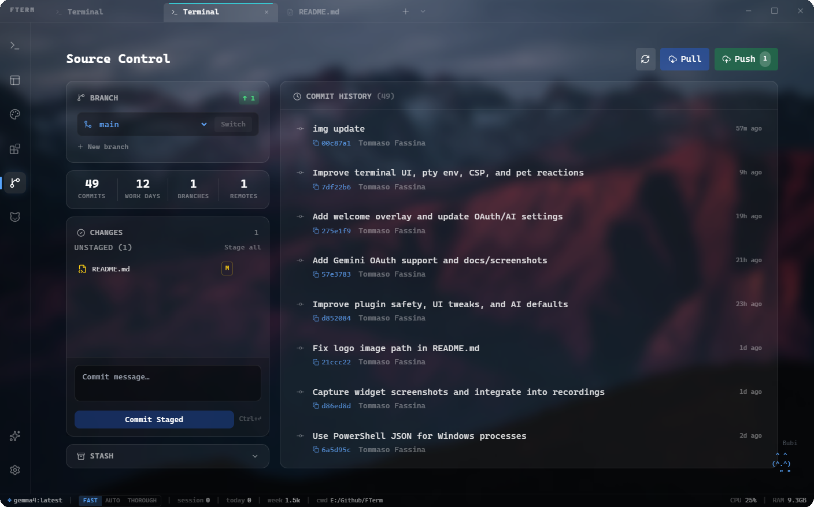
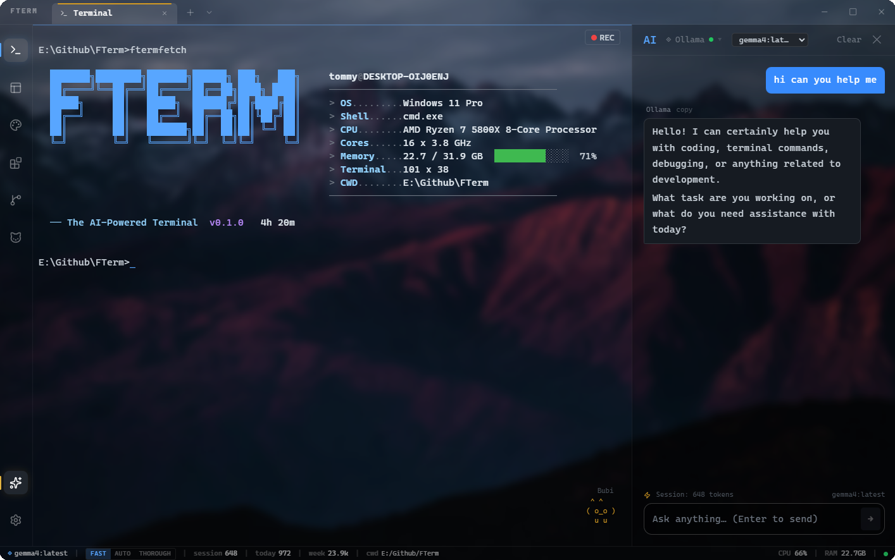

<div align="center">

# FTerm

</div>

<div align="center">



</div>

<div align="center">

A modern, AI-powered terminal emulator with a built-in Tamagotchi companion.

</div>

<div align="center">

[](https://github.com/TommasoFassina/FTerm/releases)
[](https://github.com/TommasoFassina/FTerm/releases)
[](https://creativecommons.org/licenses/by-nc/4.0/)

</div>

---

## Demo

> The first recording was captured using FTerm's built-in session recording feature.

<p align="center">
  
</p>

<p align="center">
  
  
  
  
</p>

---

## Screenshots

<p align="center">
  
  
  
  
</p>

---

## Features

### Terminal
- **Real PTY shell** — full pseudoterminal emulation via `node-pty` and `xterm.js`
- **Split panes** — horizontal and vertical splits per tab, navigate with `Ctrl+Alt+Arrow`
- **Multiple tabs** — open, close, and switch terminal tabs
- **Remote terminal** — connect to remote shells over WebSocket
- **History search** — `Ctrl+R` fuzzy search through command history
- **Command palette** — `Ctrl+Shift+P` for quick access to any action
- **Shell profiles** — save named profiles (shell, working directory, env vars, theme)
- **Keybinding customization** — remap any shortcut in settings

### AI
- **AI sidebar** — streaming chat with Claude, OpenAI, GitHub Copilot, Gemini, DeepSeek, Ollama
- **Error fix** — click the ✨ glyph next to a shell error for instant AI diagnosis
- **Quick actions** — customizable one-click prompts in the sidebar
- **System prompt editor** — built-in personas (Caveman, Pirate, ELI5, Terse…) or write your own
- **Effort levels** — fast / auto / thorough maps to different model tiers automatically

### Widgets
- **Interactive widgets** — type commands to render rich UI panels inside the terminal (see [Widget Commands](#widget-commands))
- **Plugin system** — extend FTerm with custom JavaScript plugins, hot-reloaded on save

### Recording
- **Session recording** — record your terminal session and export as an `.mp4` video
- Background rendering via ffmpeg — progress shown in the UI while encoding

### Customization
- **Themes** — GitHub Dark, Dracula, Tokyo Night, Cyberpunk, Nord, and a full custom theme editor
- **Font & background** — set font family, size, and a custom background image with blur/opacity control
- **Tamagotchi pet** — animated ASCII companion (cat, dog, dragon, robot, ghost, fox) that reacts to what you type

---

## Installation

### Windows

1. Go to the [Releases](https://github.com/TommasoFassina/FTerm/releases) page
2. Download `FTerm-x.x.x-Setup.exe` (recommended) or `FTerm-x.x.x-Portable.exe`
3. Run the installer — Windows may show a SmartScreen warning since the app is not code-signed; click **More info → Run anyway**
4. Launch FTerm from the Start Menu or Desktop shortcut

> **Portable:** No installation needed — just run the `.exe` directly.

### macOS ⚠️ Untested

> macOS builds are provided but not officially tested. Use at your own risk.

1. Download `FTerm-x.x.x.dmg` from the [Releases](https://github.com/TommasoFassina/FTerm/releases) page
2. Open the `.dmg` and drag FTerm to your Applications folder
3. On first launch, macOS may block the app — go to **System Settings → Privacy & Security** and click **Open Anyway**

### Linux ⚠️ Untested

> Linux builds are provided but not officially tested. Use at your own risk.

**AppImage:**
```bash
chmod +x FTerm-x.x.x.AppImage
./FTerm-x.x.x.AppImage
```

**Debian/Ubuntu (`.deb`):**
```bash
sudo dpkg -i FTerm-x.x.x.deb
```

---

## Widget Commands

Type any of these in the terminal to open an interactive panel. Press **Esc** to close.

| Command | Widget |
|---|---|
| `explore [path]` | File Explorer — browse files as an interactive card grid |
| `sys-mon` | System Monitor — live CPU, RAM, and network charts |
| `docker-dash` | Docker Dashboard — start/stop containers, view logs |
| `weather [city]` | Weather Card — animated current conditions card |
| `ping [host]` | Ping Monitor — live latency graph |
| `port-scan [host]` | Port Scanner — scan open ports |
| `ps` | Process Table — sortable process list |
| `query [sql]` | Data Table — SQL-like queries on system data |
| `ftermfetch` | System Info — neofetch-style summary |
| `snippets` | Snippets Manager — save and insert reusable commands |

---

## Keyboard Shortcuts

| Key | Action |
|---|---|
| `Ctrl+T` | New tab |
| `Ctrl+W` | Close tab |
| `Ctrl+Tab` | Next tab |
| `Ctrl+Shift+Tab` | Previous tab |
| `Ctrl+Shift+E` | Split pane right |
| `Ctrl+Shift+O` | Split pane down |
| `Ctrl+Alt+Arrow` | Navigate between panes |
| `Ctrl+Shift+A` | Toggle AI sidebar |
| `Ctrl+Shift+F` | Search in terminal |
| `Ctrl+R` | History search (fuzzy) |
| `Ctrl+Shift+P` | Command palette |
| `Ctrl+,` | Open settings |
| `Ctrl+=` / `Ctrl+-` | Increase / decrease font size |
| `Ctrl+0` | Reset font size |
| `Ctrl+V` / `Ctrl+Shift+V` | Paste from clipboard |
| `Ctrl+Shift+C` | Copy selection (Ctrl+C alone sends SIGINT, or copies if text is selected) |
| `Shift+Arrow` | Keyboard selection in terminal |

---

## AI Providers

Configure API keys in **Settings → AI**. Keys are stored in the OS keychain via Electron `safeStorage` and never sent back to the renderer process.

| Provider | How to connect |
|---|---|
| **Claude** | API key · Import from Claude Code CLI (`~/.claude/.credentials.json`) |
| **OpenAI** | API key · Browser OAuth (requires your own registered OAuth app) |
| **GitHub Copilot** | GitHub OAuth device flow (requires your own GitHub OAuth app) · Personal Access Token |
| **Gemini** | API key · Browser OAuth (requires your own Google Cloud OAuth client) |
| **DeepSeek** | API key |
| **Ollama** | Server URL (default `localhost:11434`) — no key needed |

OpenAI and DeepSeek support a custom base URL, so you can point them at any OpenAI-compatible API (e.g. OpenRouter).

### Privacy

FTerm does **not** ship with any pre-registered OAuth client IDs, telemetry, or proxy servers.

- Every credential (API key, OAuth client ID, OAuth token) is supplied by the user and stored locally via Electron's `safeStorage` (OS keychain — Windows DPAPI / macOS Keychain / Linux libsecret).
- The renderer process can never read keys back over IPC; only `keysHas()` / `keysListConnected()` are exposed.
- All AI requests go directly from your machine to the provider. No FTerm-controlled server ever sees your traffic, prompts, or tokens.
- If the OS keychain is unavailable, FTerm refuses to write credentials rather than fall back to plaintext.

---

## Session Recording

Click the **record button** (top-right of any terminal pane) to start capturing.

- Terminal output is sampled at 10 fps during the session
- Widgets open during recording are composited as overlays
- Stop recording to trigger background video encoding
- The finished `.mp4` is saved to your system **Videos** folder

---

## Snippets

Open the **Snippets** widget (`snippets` command or `Ctrl+Shift+P → Snippets`) to save reusable commands. Click any snippet to paste it into the active terminal.

**Example snippets you can add:**

| Name | Command |
|---|---|
| Git log pretty | `git log --oneline --graph --decorate --all` |
| Kill port 3000 | `npx kill-port 3000` |
| Docker clean | `docker system prune -af --volumes` |
| Disk usage (sorted) | `du -sh * \| sort -rh \| head -20` |
| NPM clean install | `rm -rf node_modules package-lock.json && npm install` |
| Show open ports | `netstat -ano \| findstr LISTENING` |
| Tail app log | `tail -f ~/.local/share/myapp/app.log` |
| SSH tunnel | `ssh -L 5432:localhost:5432 user@remote-host` |

---

## Plugin System

Open the **Plugins** view to enable built-in plugins or write custom ones. Plugins are plain JavaScript objects with lifecycle hooks — edits are hot-reloaded on save, no restart needed.

### Plugin API

```ts
interface FTermPlugin {
  id: string
  name: string
  description: string
  version: string
  onLoad?: () => void                                          // plugin enabled
  onUnload?: () => void                                        // plugin disabled
  onPtyData?: (data: string) => void                          // raw PTY output
  onTerminalReady?: (terminal: Terminal, instanceId: string) => void  // xterm.js ready
}
```

### Example: Git branch in prompt banner

Watches PTY output for directory changes and prints the current git branch as a styled banner whenever you `cd` into a git repo.

```js
{
  id: 'git-branch-banner',
  name: 'Git Branch Banner',
  description: 'Shows current git branch when entering a repo',
  version: '1.0.0',

  onPtyData: (data) => {
    // detect OSC 7 CWD changes (FTerm emits these natively)
    if (data.includes('\x1b]7;')) {
      const match = data.match(/\x1b\]7;file:\/\/[^/]*(\/.+?)(?:\x07|\x1b\\)/)
      if (!match) return
      // branch name via a side-channel is not available in renderer,
      // but you can parse it from subsequent prompt output
    }
  },

  onTerminalReady: (term, instanceId) => {
    // inject a welcome banner on every new terminal
    term.writeln('\x1b[38;5;99m  FTerm git-branch-banner active\x1b[0m')
  }
}
```

### Example: Error sound alert

Plays a system beep when a command exits with a non-zero code (detected via FTerm's OSC 9998 exit code sequence).

```js
{
  id: 'error-beep',
  name: 'Error Beep',
  description: 'Beep on command failure',
  version: '1.0.0',

  onPtyData: (data) => {
    // FTerm writes \x1b]9998;<exitcode>\x07 after each command
    const match = data.match(/\x1b\]9998;(\d+)(?:\x07|\x1b\\)/)
    if (match && parseInt(match[1], 10) !== 0) {
      // Web Audio API is available in the renderer
      const ctx = new AudioContext()
      const osc = ctx.createOscillator()
      osc.connect(ctx.destination)
      osc.frequency.value = 440
      osc.start()
      osc.stop(ctx.currentTime + 0.12)
    }
  }
}
```

### Example: Auto-timestamp log

Logs every command with a timestamp to `localStorage` — useful for building a personal activity log.

```js
{
  id: 'command-logger',
  name: 'Command Logger',
  description: 'Timestamps every command to localStorage',
  version: '1.0.0',

  onLoad: () => {
    if (!localStorage.getItem('fterm-cmd-log')) {
      localStorage.setItem('fterm-cmd-log', JSON.stringify([]))
    }
  },

  onPtyData: (data) => {
    // capture input lines (user keystrokes echo back with CR)
    if (data.includes('\r\n') || data.includes('\r')) {
      const log = JSON.parse(localStorage.getItem('fterm-cmd-log') || '[]')
      log.push({ ts: new Date().toISOString(), raw: data.trim() })
      // keep last 1000 entries
      if (log.length > 1000) log.splice(0, log.length - 1000)
      localStorage.setItem('fterm-cmd-log', JSON.stringify(log))
    }
  }
}
```

---

## Roadmap

Planned features and ideas — contributions welcome.

### Stats & Activity
- **GitHub-style workday heatmap** — visualize terminal activity (commands run, errors, sessions) as a contribution-style calendar grid
- **Session streaks** — track consecutive active days; display current streak and longest streak in the Stats panel
- **Accurate session stats** — per-command timing, error rate, most-used commands, busiest hours histogram
- **Fitbit / health sync** — correlate coding activity with sleep, steps, and heart rate from Fitbit or Apple Health; show "deep work" scores alongside health data

### `ftermfetch` Customization
- **Custom layout editor** — drag-and-drop which fields appear in the `ftermfetch` output (hostname, OS, shell, pet level, AI usage, uptime…)
- **Color scheme picker** — choose accent colors per field, or match the active FTerm theme automatically
- **Cross-platform shell alias** — proper `ftermfetch` shell function for bash/zsh/fish (currently Windows-only via `doskey`)
- **Export as image** — save the `ftermfetch` card as a `.png` for sharing

### AI & Workflow
- **AI context memory** — let the AI sidebar remember project-specific facts across sessions (stored locally, never sent unless relevant)
- **Inline diff view** — when AI suggests a code fix, show a side-by-side diff before applying it to a file in the Monaco editor
- **Voice input** — push-to-talk to dictate commands or chat messages

### Terminal
- **Session restore** — reconnect to a detached PTY session after FTerm restarts (tmux-style persistence)
- **Broadcast input** — type once, send to all open panes simultaneously
- **Scrollback search with regex** — highlight all matches in the scrollback buffer, not just navigate one by one

### Pet
- **Pet achievements** — unlock cosmetics (hats, accessories) by hitting coding milestones
- **Pet export** — export your pet's stats and history as a shareable card

---

## Development

Requires **Node.js 18+** and **npm**.

```bash
git clone https://github.com/TommasoFassina/FTerm.git
cd FTerm
npm install
npm run electron:dev      # Vite + Electron with hot reload
```

Other commands:

```bash
npm run electron:build    # Production build → release/
npm run typecheck         # TypeScript check
npm run lint              # ESLint
```

---

## Architecture

```
electron/                        # Main process (Node.js / Electron)
├── main.ts                      # Window, IPC handlers, app lifecycle
├── preload.ts                   # contextBridge → window.fterm API (no Node in renderer)
├── services/
│   ├── ptyManager.ts            # node-pty session lifecycle (create/write/resize/kill)
│   ├── aiService.ts             # AI provider routing + streaming over IPC
│   ├── secureStore.ts           # OS keychain via safeStorage
│   ├── githubOAuth.ts           # GitHub OAuth device flow + Copilot token exchange
│   └── remoteTerminalServer.ts  # WebSocket server for remote PTY sessions
└── video/
    ├── FrameRenderer.ts         # Canvas-based terminal frame renderer
    ├── SceneDetector.ts         # Command/error scene detection from events
    └── VideoComposer.ts         # ffmpeg video assembly from frame snapshots

src/                             # Renderer (React + TypeScript, no Node access)
├── App.tsx                      # Root layout
├── store/index.ts               # Zustand store (tabs, themes, pet, AI, settings)
├── services/
│   └── TerminalRecorder.ts      # Captures terminal snapshots + command events
└── components/
    ├── Terminal/                 # xterm.js + PTY, split panes, recording controls, history search
    ├── Widgets/                  # File explorer, sys-mon, docker, weather, ping, port-scan, snippets
    ├── AI/                       # Streaming chat sidebar + message rendering
    ├── Pet/                      # Animated ASCII tamagotchi
    └── Views/                    # Settings, Themes, Plugins, Git, Pet, Profiles, Stats
```

---

## Platform Notes

FTerm is developed and tested on **Windows**. macOS and Linux builds are provided but **not officially tested** — bugs on those platforms are welcome but may take longer to address.

Most features are cross-platform. A few exceptions:

| Feature | Windows | macOS | Linux |
|---|---|---|---|
| Core terminal, AI, themes, git, recording | ✅ | ✅ | ✅ |
| All widgets (weather, sys-mon, ping…) | ✅ | ✅ | ✅ |
| `ftermfetch` shell command alias | ✅ | ⚠️ widget only | ⚠️ widget only |

> **`ftermfetch` on macOS/Linux:** The `ftermfetch` terminal widget renders correctly, but the shell alias (`doskey`/PowerShell init) is Windows-only. On Unix you can open the widget via the command palette instead.

---

## Changelog

See [CHANGELOG.md](CHANGELOG.md) for release history.

---

> **Disclaimer:** FTerm is an independent open-source project, not affiliated with or endorsed by Anthropic, OpenAI, Microsoft, Google, or any AI provider. Use at your own risk. macOS builds are provided but **not tested** — issues specific to macOS are welcome via the issue tracker but may not be prioritized.

---

## License

CC BY-NC 4.0 — see [LICENSE](LICENSE).
