<div align="center">

# FTerm

</div>

<div align="center">

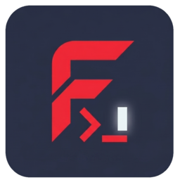

</div>

<div align="center">

A modern, AI-powered terminal emulator with a built-in Tamagotchi companion.

</div>

<div align="center">

[](https://github.com/TommasoFassina/FTerm/releases)
[](https://github.com/TommasoFassina/FTerm/releases)
[](https://creativecommons.org/licenses/by-nc/4.0/)
[](https://github.com/TommasoFassina/FTerm/releases/)

</div>

---

## Demo

> The first recording was captured using FTerm's built-in session recording feature.

<p align="center">
  
</p>

<p align="center">
  
  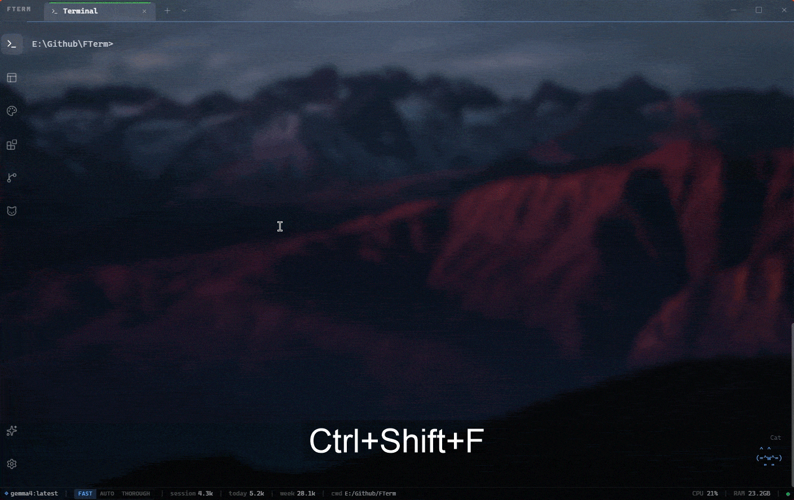
  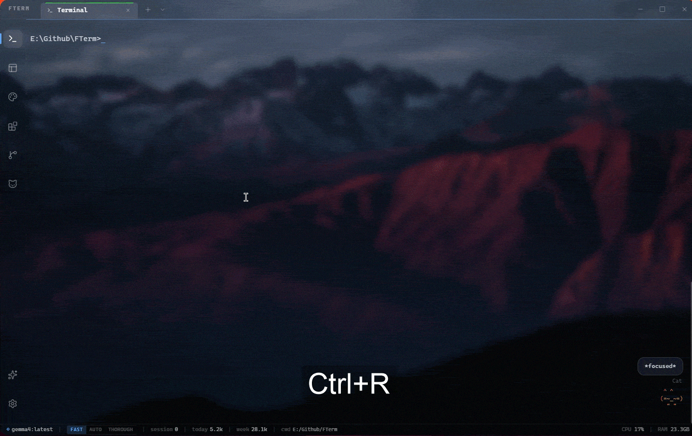
  
</p>

---

## Screenshots

<p align="center">

  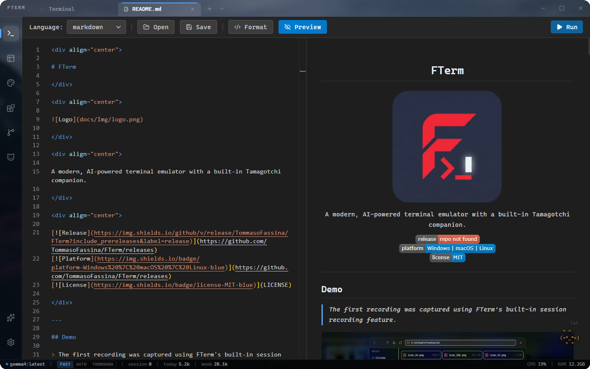
  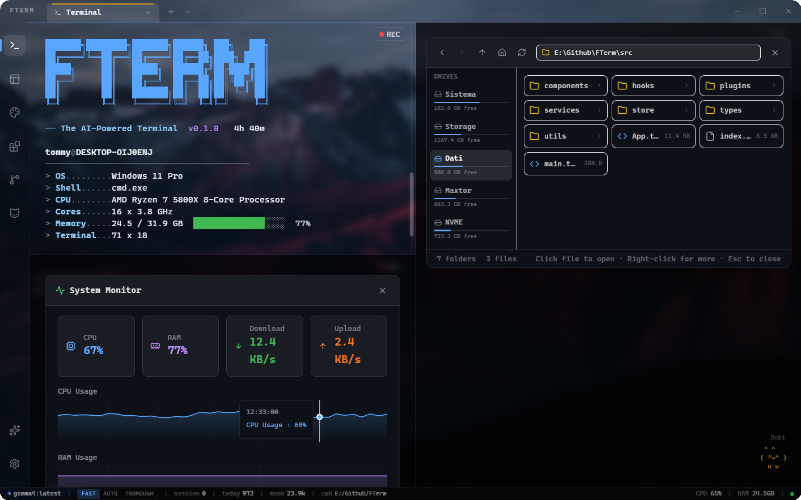
  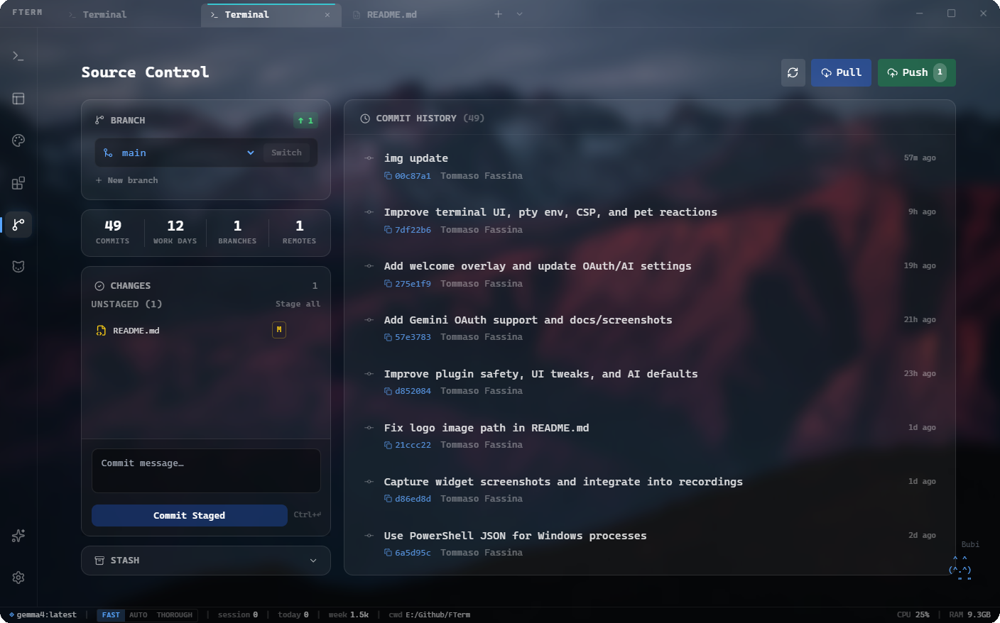
  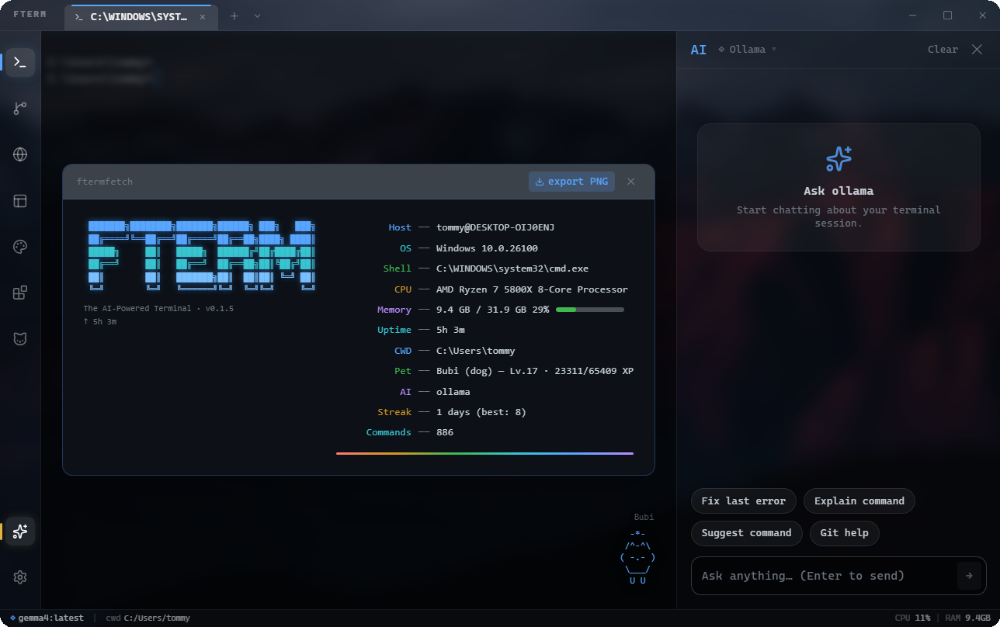

</p>

> Built in browser

<p align="center">
  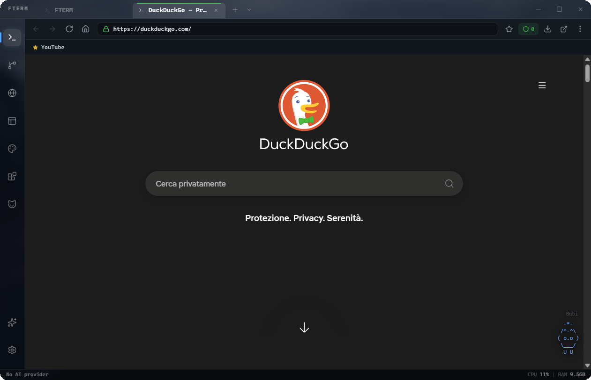
  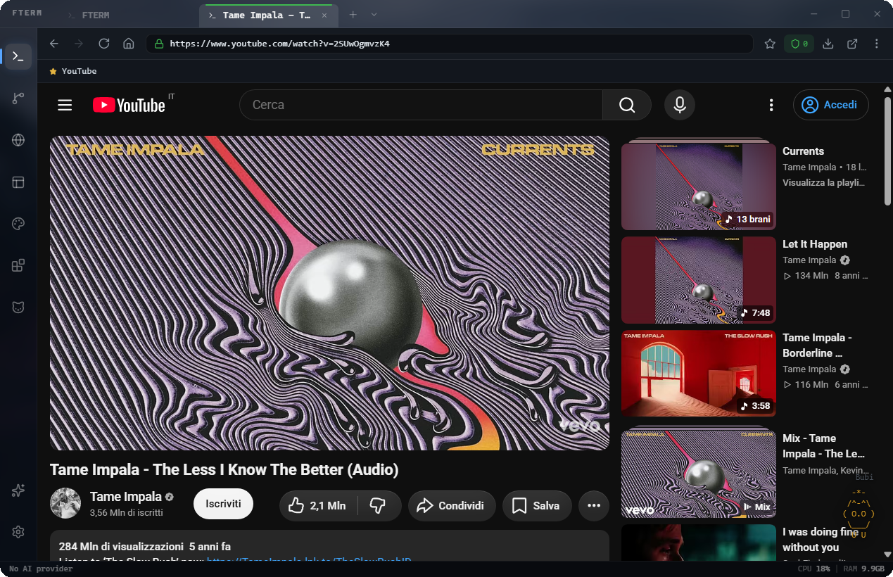
</p>

> Widget: viz (music player and visualizer)

<p align="center">
  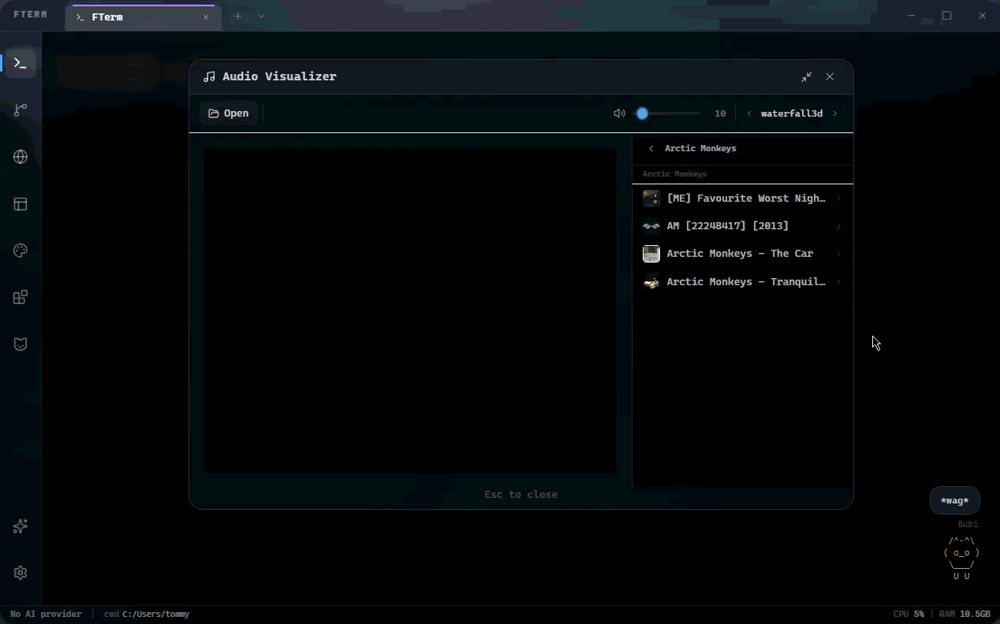
</p>

<p align="center">
  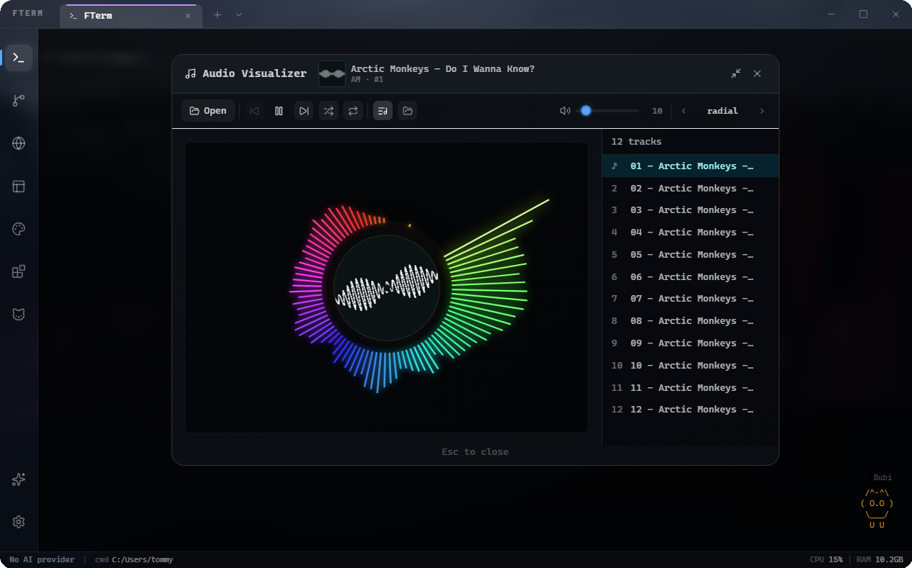
  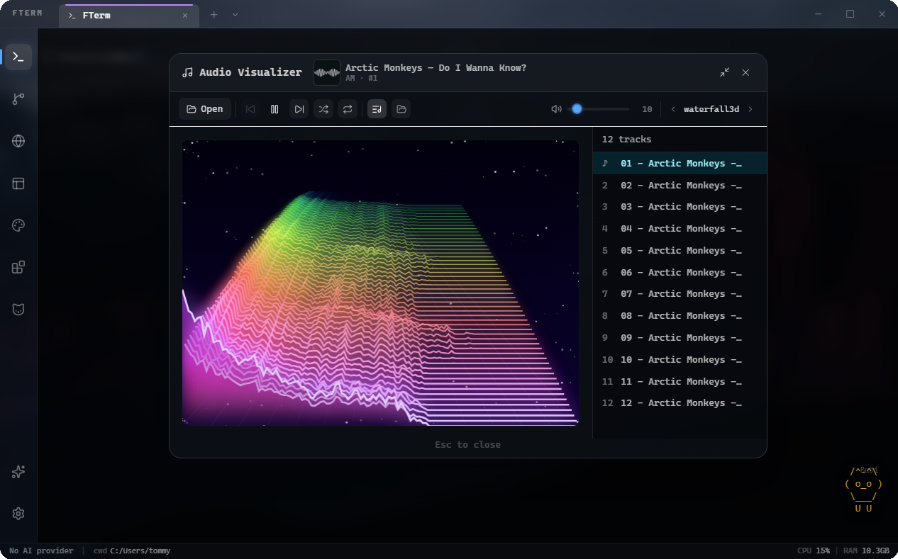

  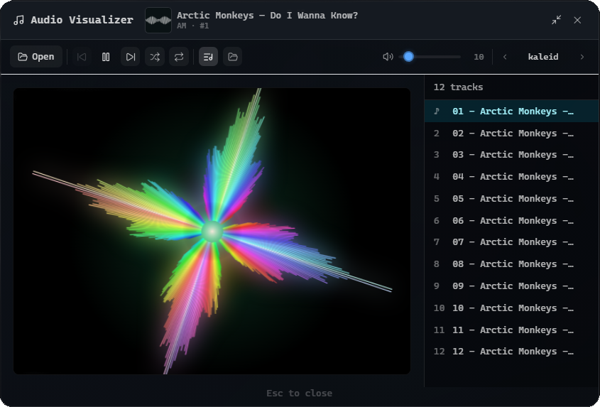
  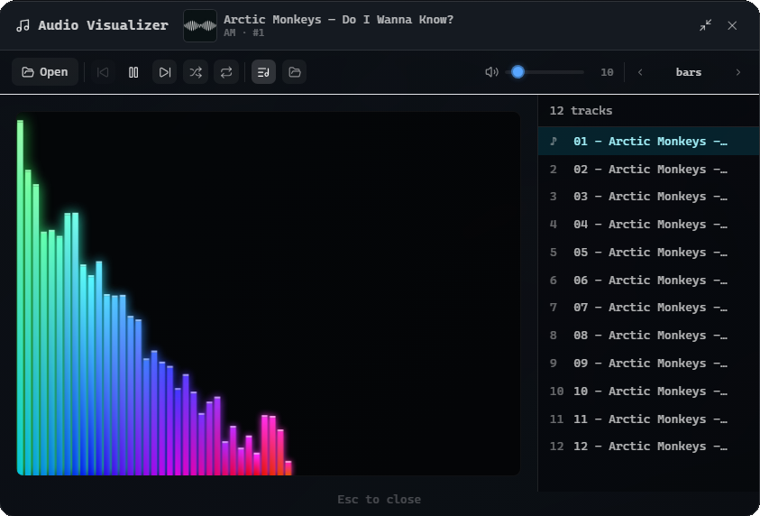

</p>

---

## Features

### Terminal
- **Real PTY shell** — full pseudoterminal emulation via `node-pty` and `xterm.js`
- **Command blocks** — OSC 133 shell integration slices the scrollback into one block per command, each with its exit code, duration and cwd. `Ctrl+Shift+↑/↓` jumps prompt to prompt, `Ctrl+Shift+B` opens the session's command list (scroll to a command, copy it or its output, preview inline), and a coloured rail in the gutter marks running / succeeded / failed
- **Drop-down terminal** — a global hotkey summons FTerm over any application and tucks it away again; configurable edge, size, monitor and hide-on-blur (Settings → General)
- **Split panes** — horizontal and vertical splits per tab, navigate with `Ctrl+Alt+Arrow`
- **Multiple tabs** — open, close, and switch terminal tabs
- **Remote terminal** — connect to remote shells over WebSocket; full mobile control surface with Term / AI / Tools tabs, sticky modifier key bar, quick-launcher chips, and widget parity (file explorer, system monitor, docker, weather, ping, port scanner, clipboard)
- **Persistent command history** — every finished command is kept with its exit code, duration and working directory, across sessions. `Ctrl+Shift+H` searches it with real filters (`npm cwd:fterm exit:fail since:7d`); Enter puts a command back on the prompt without running it. Passwords, tokens and keys are stripped before anything is written, a command typed with a leading space is never recorded, and output capture is a separate switch that is off by default
- **History search** — `Ctrl+R` fuzzy search through the shell's own history
- **Command palette** — `Ctrl+Shift+P` for quick access to any action
- **Frequent directories** — every `cd` is remembered and ranked zoxide-style (how often × how recently); type `z` and a few letters in the command palette to jump there. A busy pane gets a new tab in that directory instead of keystrokes typed into a running program
- **Shell profiles** — save named profiles (shell, working directory, env vars, tab colour, theme). A profile can pin its own theme — a red one for production shells — while every other pane follows the app theme
- **Keybinding customization** — remap any shortcut in settings
- **Shell auto-restart** — shell respawns automatically in the same CWD when it exits (configurable in General → Terminal)
- **SSH host manager** — save SSH connections in Settings → Remote and one-click connect from the command palette; key/agent auth only, no passwords stored
- **In-app browser** — a built-in hardened web browser as a dedicated tab or `browser` widget; isolated session, ad/tracker blocking, session-only history, granular clear-data controls

### AI
- **AI sidebar** — streaming chat with Claude, OpenAI, GitHub Copilot, Gemini, DeepSeek, Ollama
- **Error fix** — click the ✨ glyph next to a shell error for instant AI diagnosis
- **Quick actions** — customizable one-click prompts in the sidebar
- **System prompt editor** — built-in personas (Caveman, Pirate, ELI5, Terse…) or write your own
- **Effort levels** — fast / auto / thorough maps to different model tiers automatically
- **Code block actions** — run shell code directly in the active terminal, insert at cursor, or save to file from any AI response
- **AI command builder** (`Ctrl+K`) — describe a task in plain English; the active provider generates a single shell command with terminal context (OS, shell, CWD, git branch), previewed for review before you press Enter
- **Claude Code CLI stats** — while `claude` runs in TUI mode, FTerm extracts live model name, token counts, context window %, and cost; displayed as a live segment in the status bar

### Widgets
- **Interactive widgets** — type commands to render rich UI panels inside the terminal (see [Widget Commands](#widget-commands))
- **Plugin system** — extend FTerm with custom JavaScript plugins, hot-reloaded on save

### Recording
- **Session recording** — record any pane, with pause and resume
- **Recording studio** — stopping opens an editor rather than starting an encode: scrub the take, trim it, cut spans out of the middle, set speed, size, frame rate and quality, then export. Undo/redo over every edit. The preview is painted by the same code as the exporter, so what you scrub through is the file you get
- **Automatic camera** — finds whatever is changing on screen and pushes in on it, holding each framing long enough to read and easing between them; switchable, with live preview
- **Three formats** — `.mp4`, an animated GIF (one palette for the whole clip, so the theme survives), or an asciicast `.cast`: the text itself rather than a picture of it, kilobytes instead of megabytes and selectable in a player
- **Copy a command block as an image** — a PNG of the command, its output, the working directory and the exit code and duration, in your theme; clipboard or file

### Editor
- **Monaco editor tabs** — open a file from the explorer or the toolbar, edit and run it from the same tab
- **Painted in your terminal theme** — the editor follows the active palette instead of being pinned to VS Code grey; light schemes included
- **Unsaved-change tracking** — a dot in the tab bar and a confirmation before a dirty tab closes
- **Watches the file on disk** — if something changes it underneath you, a banner offers Reload, Overwrite or Dismiss
- **Recent files**, Save As (`Ctrl+Shift+S`), reload, format, find, minimap and word-wrap toggles, and a searchable language picker that matches on extension
- **Run it** — a saved file runs from where it lives, so relative imports behave; JavaScript, TypeScript, Python, Go, Rust, Ruby, PHP, Lua, shell, PowerShell and batch
- **Markdown preview** side by side, scroll-synced

### Customization
- **Themes** — GitHub Dark, Dracula, Tokyo Night, Cyberpunk, Nord, and a full custom theme editor
- **Theme import** — load iTerm2 `.itermcolors` files and Windows Terminal colour schemes (single scheme, array, or an entire `settings.json`)
- **Font & background** — set font family, size, and a custom background image with blur/opacity control
- **Tamagotchi pet** — animated ASCII companion (cat, dog, dragon, robot, ghost, fox) that reacts to what you type — and, where the shell reports exit codes, to whether commands actually succeeded, so "0 errors" in a passing build no longer makes it sad — earns achievements and coins from real terminal activity, and wears ASCII cosmetics bought in the wardrobe

---

## Installation

### Windows

1. Go to the [Releases](https://github.com/TommasoFassina/FTerm/releases) page
2. Download `FTerm-x.x.x-Setup.exe` (recommended) or `FTerm-x.x.x-Portable.exe`
3. Run the installer — Windows may show a SmartScreen warning since the app is not code-signed; click **More info → Run anyway**
4. Launch FTerm from the Start Menu or Desktop shortcut

> **Portable:** No installation needed — just run the `.exe` directly.

### macOS ⚠️ Untested

> macOS builds are provided but not officially tested. Use at your own risk.

1. Download `FTerm-x.x.x.dmg` from the [Releases](https://github.com/TommasoFassina/FTerm/releases) page
2. Open the `.dmg` and drag FTerm to your Applications folder
3. On first launch, macOS may block the app — go to **System Settings → Privacy & Security** and click **Open Anyway**

### Linux ⚠️ Untested

> Linux builds are provided but not officially tested. Use at your own risk.

**AppImage:**
```bash
chmod +x FTerm-x.x.x.AppImage
./FTerm-x.x.x.AppImage
```

**Debian/Ubuntu (`.deb`):**
```bash
sudo dpkg -i FTerm-x.x.x.deb
```

---

## Widget Commands

Type any of these in the terminal to open an interactive panel. Press **Esc** to close.

> ⚠️ **Photosensitivity notice:** The audio visualizer (`viz`) contains rapidly flashing lights and strobing effects that may trigger seizures or discomfort in people with photosensitive epilepsy. A warning is shown on first use. If sensitive, select the *None* style (audio only, no visuals) or avoid the feature entirely.

| Command | Widget |
|---|---|
| `explore [path]` | File Explorer — browse files as an interactive card grid |
| `sys-mon` | System Monitor — live CPU, RAM, and network charts |
| `docker-dash` | Docker Dashboard — start/stop containers, view logs |
| `weather [city]` | Weather Card — animated current conditions card |
| `ping [host]` | Ping Monitor — live latency graph |
| `port-scan [host]` | Port Scanner — scan open ports (`portscan` also works) |
| `ps` | Process Table — sortable process list |
| `ftermfetch` | System Info — customizable neofetch-style card; export as PNG |
| `snippets` | Snippets Manager — save and insert reusable commands |
| `imgcat <path>` | Image Viewer — open an image in a full-pane overlay with zoom controls |
| `viz [path]` | Audio Visualizer — play audio files with 11 real-time visualizer styles, queue management, beat-sync pet ⚠️ |
| `clipboard` | Clipboard Manager — read / write host clipboard, paste directly to terminal |
| `browse [url]` / `browser [url]` | Web Browser — hardened in-app browser overlay with ad/tracker blocking and bookmarks |
| `note` / `notes` | Notes Scratchpad — per-session markdown notes with autosave; optional export to `~/.fterm/notes/` |

---

## Keyboard Shortcuts

| Key | Action |
|---|---|
| `Ctrl+T` | New tab |
| `Ctrl+W` | Close tab |
| `Ctrl+Tab` | Next tab |
| `Ctrl+Shift+Tab` | Previous tab |
| `Ctrl+Shift+E` | Split pane right |
| `Ctrl+Shift+O` | Split pane down |
| `Ctrl+Alt+Arrow` | Navigate between panes |
| `Ctrl+Shift+A` | Toggle AI sidebar |
| `Ctrl+K` | AI command builder |
| `Ctrl+Shift+F` | Search in terminal |
| `Ctrl+R` | History search (fuzzy) |
| `Ctrl+Shift+P` | Command palette |
| `Ctrl+,` | Open settings |
| `Ctrl+=` / `Ctrl+-` | Increase / decrease font size |
| `Ctrl+0` | Reset font size |
| `Ctrl+V` / `Ctrl+Shift+V` | Paste from clipboard |
| `Ctrl+Shift+C` | Copy selection (Ctrl+C alone sends SIGINT, or copies if text is selected) |
| `Shift+Arrow` | Keyboard selection in terminal |
| `Ctrl+Shift+L` | Force redraw (escape hatch for stuck TUI ghosting) |
| `Ctrl+Shift+↑` / `Ctrl+Shift+↓` | Jump to previous / next command prompt |
| `Ctrl+Shift+B` | Toggle the command block list for the pane |
| `Ctrl+Shift+H` | Search every command ever run |
| _(configurable)_ | Summon / hide the drop-down terminal — set your own hotkey in Settings → General |

---

## AI Providers

> [!WARNING]
> **Bring-your-own-API-key setup is deprecated.** Configuring an AI provider by pasting a personal API key is no longer the direction FTerm is going, and this path may be removed in a future release. Nothing breaks today — existing keys keep working and stay encrypted in the OS keychain — but AI features are planned to become zero-configuration, detecting AI CLIs already authenticated on your machine (`claude`, `gh copilot`, `ollama`) instead of asking for a key. If you rely on a manual key, watch the [changelog](CHANGELOG.md) before upgrading.

Configure API keys in **Settings → AI**. Keys are stored in the OS keychain via Electron `safeStorage` and never sent back to the renderer process.

| Provider | How to connect |
|---|---|
| **Claude** | API key · Import from Claude Code CLI (`~/.claude/.credentials.json`) |
| **OpenAI** | API key · Browser OAuth (requires your own registered OAuth app) |
| **GitHub Copilot** | GitHub OAuth device flow (requires your own GitHub OAuth app) · Personal Access Token |
| **Gemini** | API key · Browser OAuth (requires your own Google Cloud OAuth client) |
| **DeepSeek** | API key |
| **Ollama** | Server URL (default `localhost:11434`) — no key needed |

OpenAI and DeepSeek support a custom base URL, so you can point them at any OpenAI-compatible API (e.g. OpenRouter).

### Privacy

FTerm does **not** ship with any pre-registered OAuth client IDs, telemetry, or proxy servers.

- Every credential (API key, OAuth client ID, OAuth token) is supplied by the user and stored locally via Electron's `safeStorage` (OS keychain — Windows DPAPI / macOS Keychain / Linux libsecret).
- The renderer process can never read keys back over IPC; only `keysHas()` / `keysListConnected()` are exposed.
- All AI requests go directly from your machine to the provider. No FTerm-controlled server ever sees your traffic, prompts, or tokens.
- If the OS keychain is unavailable, FTerm refuses to write credentials rather than fall back to plaintext.

---

## Session Recording

Click the **record button** (top-right of any terminal pane) to start capturing. Pause and resume as you go.

- Terminal output is sampled at 10 fps; identical frames are skipped, so an idle terminal costs nothing
- Widgets open during recording are composited as overlays
- **Stopping opens the studio**, not an encoder. Nothing is written to disk until you ask for it

In the studio you can:

- **Scrub** the take and step frame by frame (`Space`, `←`/`→`, `Home`/`End`)
- **Trim** with the grips or `I` / `O`, and **cut** spans out of the middle — drag across the lower lane to select, then `X`. Click a red block to put it back
- **Undo / redo** every edit with `Ctrl+Z` / `Ctrl+Shift+Z`
- Set **speed**, **size** (up to 1080p, or square for social), **frame rate** and **quality**
- Turn the **automatic camera** on or off and tune how far it zooms, how long it holds a framing and how slowly it moves
- Export as **`.mp4`**, **GIF** or **`.cast`** — and re-export the same take at different settings without recording again

The finished file is saved to your system **Videos** folder. Recording stops itself after 20 minutes.

---

## Command History

Every command that finishes is written to `command-history.jsonl` in FTerm's data folder, with its exit code, duration and working directory.

Press `Ctrl+Shift+H` to search it:

| Query | Finds |
|---|---|
| `npm build` | anything whose command line contains both words |
| `cwd:fterm` | commands run anywhere under a path containing "fterm" |
| `exit:fail` | commands that returned a non-zero exit code |
| `since:7d` | the last week (`m`, `h`, `d`, `w`) |
| `npm cwd:website exit:fail since:2d` | all of the above at once |

Repeats collapse onto their most recent run with a count. Enter puts a command back on the prompt **without running it**.

**What is not recorded.** Values that look like passwords, tokens, API keys or credentials are stripped before anything reaches disk — including credentials inside URLs, the attached `-ppassword` form, PowerShell `$env:` assignments, and the known token shapes (GitHub, GitLab, OpenAI, Anthropic, Google, AWS, Slack, npm, Hugging Face, Stripe, JWT). Commands whose arguments are secrets by definition (`psql`, `openssl`, `gpg`, `mysql`…) keep the command name and nothing else. A command **typed with a leading space is never recorded at all**, the convention every POSIX shell already uses.

Capturing each command's **output** is a separate switch and is **off by default** — it is the part most likely to contain something you did not mean to keep.

Both switches, a stats readout and a delete-everything button are in **Settings → General → Command history**.

---

## Snippets

Open the **Snippets** widget (`snippets` command or `Ctrl+Shift+P → Snippets`) to save reusable commands. Click any snippet to paste it into the active terminal.

**Example snippets you can add:**

| Name | Command |
|---|---|
| Git log pretty | `git log --oneline --graph --decorate --all` |
| Kill port 3000 | `npx kill-port 3000` |
| Docker clean | `docker system prune -af --volumes` |
| Disk usage (sorted) | `du -sh * \| sort -rh \| head -20` |
| NPM clean install | `rm -rf node_modules package-lock.json && npm install` |
| Show open ports | `netstat -ano \| findstr LISTENING` |
| Tail app log | `tail -f ~/.local/share/myapp/app.log` |
| SSH tunnel | `ssh -L 5432:localhost:5432 user@remote-host` |

---

## Plugin System

Open the **Plugins** view to enable built-in plugins or write custom ones. Plugins are plain JavaScript objects with lifecycle hooks — edits are hot-reloaded on save, no restart needed.

### Plugin API

```ts
interface FTermPlugin {
  id: string
  name: string
  description: string
  version: string
  onLoad?: () => void                                          // plugin enabled
  onUnload?: () => void                                        // plugin disabled
  onPtyData?: (data: string) => void                          // raw PTY output
  onTerminalReady?: (terminal: Terminal, instanceId: string) => void  // xterm.js ready
}
```

### Example: Git branch banner on `cd`

Watches OSC 7 CWD notifications (emitted by FTerm's PowerShell and cmd prompt functions on every prompt redraw) and prints the current git branch whenever you enter a repo.

> **OSC 7 availability:** emitted automatically by FTerm for PowerShell and cmd. Bash/WSL/fish do not emit OSC 7 unless you add `printf '\e]7;file://%s%s\a' "$HOSTNAME" "$PWD"` to your prompt.

```js
{
  id: 'git-branch-banner',
  name: 'Git Branch Banner',
  description: 'Shows current git branch when you cd into a repo',
  version: '1.0.0',

  onPtyData: (data) => {
    // OSC 7 carries the new CWD on every prompt redraw
    const match = data.match(/\x1b\]7;file:\/\/[^/]*(\/.+?)(?:\x07|\x1b\\)/)
    if (!match) return
    let cwd = decodeURIComponent(match[1])
    // Windows paths arrive as /C:/Users/... — strip leading slash
    if (/^\/[A-Za-z]:/.test(cwd)) cwd = cwd.slice(1)

    // Ask FTerm's git service for the branch (returns null outside a repo)
    window.fterm.git.status(cwd).then(status => {
      if (!status?.branch) return
      // Find the terminal that triggered this OSC 7 and write to it
      // (all terminals share onPtyData, so we write to the focused one)
      const term = window.__ftermActiveTerminal
      if (term) term.writeln('\x1b[38;5;99m   ' + status.branch + '\x1b[0m')
    }).catch(() => {})
  }
}
```

> `window.__ftermActiveTerminal` is set by FTerm whenever a terminal pane gains focus. It gives plugins a reference to the currently active xterm instance without needing to track `instanceId` manually.

### Example: Error sound alert

Plays a system beep when a command exits with a non-zero code (detected via FTerm's OSC 9998 exit code sequence).

```js
{
  id: 'error-beep',
  name: 'Error Beep',
  description: 'Beep on command failure',
  version: '1.0.0',

  onPtyData: (data) => {
    // FTerm writes \x1b]9998;<exitcode>\x07 after each command
    const match = data.match(/\x1b\]9998;(\d+)(?:\x07|\x1b\\)/)
    if (match && parseInt(match[1], 10) !== 0) {
      // Web Audio API is available in the renderer
      const ctx = new AudioContext()
      const osc = ctx.createOscillator()
      osc.connect(ctx.destination)
      osc.frequency.value = 440
      osc.start()
      osc.stop(ctx.currentTime + 0.12)
    }
  }
}
```

### Example: Auto-timestamp log

Logs every command with a timestamp to `localStorage` — useful for building a personal activity log.

```js
{
  id: 'command-logger',
  name: 'Command Logger',
  description: 'Timestamps every command to localStorage',
  version: '1.0.0',

  onLoad: () => {
    if (!localStorage.getItem('fterm-cmd-log')) {
      localStorage.setItem('fterm-cmd-log', JSON.stringify([]))
    }
  },

  onPtyData: (data) => {
    // capture input lines (user keystrokes echo back with CR)
    if (data.includes('\r\n') || data.includes('\r')) {
      const log = JSON.parse(localStorage.getItem('fterm-cmd-log') || '[]')
      log.push({ ts: new Date().toISOString(), raw: data.trim() })
      // keep last 1000 entries
      if (log.length > 1000) log.splice(0, log.length - 1000)
      localStorage.setItem('fterm-cmd-log', JSON.stringify(log))
    }
  }
}
```

---

## Roadmap

Planned features and ideas — contributions welcome.

### Stats & Activity
- ✅ **GitHub-style workday heatmap** — 53-week × 7-day contribution grid in the Stats panel; hover for daily command/error counts
- ✅ **Session streaks** — current streak and longest streak badges in the Stats panel
- ✅ **Accurate session stats** — error rate, most-used commands bar chart, busiest hours histogram

> not planned as of now

- **Fitbit / health sync** — correlate coding activity with sleep, steps, and heart rate from Fitbit or Apple Health; show "deep work" scores alongside health data
- ✅ **Per-command timing** — every command's duration is recorded in the persistent history and searchable; aggregate views (slowest commands, p95) are still open

### `ftermfetch` Customization
- ✅ **Custom layout editor** — toggle and reorder fields (hostname, OS, shell, pet level, AI usage, uptime, streak…) in Settings → Stats
- ✅ **Color scheme picker** — theme-derived accent colors per field, or custom hex via color picker
- ✅ **Cross-platform shell function** — bash, zsh, and fish init scripts (in addition to PowerShell and CMD)
- ✅ **Export as PNG** — save the `ftermfetch` card directly from the widget

### AI & Workflow (not planned as of now)
- **AI context memory** — let the AI sidebar remember project-specific facts across sessions (stored locally, never sent unless relevant)
- **Inline diff view** — when AI suggests a code fix, show a side-by-side diff before applying it to a file in the Monaco editor
- **Voice input** — push-to-talk to dictate commands or chat messages

### Distribution
- **Code signing** — removes the SmartScreen warning and the first-launch Defender scan. Azure Trusted Signing (~$10/month, no hardware token) is the likely route; OV certificates have required an HSM or token since June 2023, and only EV grants SmartScreen reputation immediately. This should land **before** in-app updates: shipping self-updating unsigned binaries makes the warning worse, not better
- ✅ **Update notice** — once a day FTerm checks GitHub's release list and shows a link when a newer version is out (Settings → General → Updates). Nothing is downloaded or installed automatically
- **In-app updates** — update in place instead of downloading the installer by hand; waits for code signing

### Terminal
- ✅ **Command blocks** — OSC 133 shell integration; prompt-to-prompt navigation, per-command exit code and timing, copy output without selecting
- ✅ **Drop-down terminal** — global hotkey summons FTerm over any application
- ✅ **Persistent command history** — searchable across sessions, with exit code, duration and directory; secrets redacted before anything is written
- **Session restore** — reconnect to a detached PTY session after FTerm restarts (tmux-style persistence)
- **Broadcast input** — type once, send to all open panes simultaneously
- **Scrollback search with regex** — highlight all matches in the scrollback buffer, not just navigate one by one
- **Collapsible command output** — fold a noisy block in place. Blocked on xterm.js: its buffer is a flat grid with no concept of hidden rows, so folding needs a buffer rewrite rather than a decoration. The block list's inline preview covers the same need for now.

### Themes
- ✅ **Import iTerm2 / Windows Terminal schemes** — `.itermcolors` files and Windows Terminal `settings.json` colour schemes
- ✅ **Per-profile theme** — bind a theme to a shell profile so each context looks distinct

### Recording
- ✅ **Recording studio** — trim, cut, speed, size and frame rate before anything is encoded, with undo
- ✅ **Automatic camera** — frames what is changing on screen and eases between framings
- ✅ **GIF and asciicast export** — `.cast` is the text itself, not a picture of it
- **Audio narration** — record microphone alongside the terminal and mux it into the video

### Pet
- ✅ **Pet achievements** — 15 achievements from real terminal activity, paying coins
- ✅ **Cosmetics shop** — spend coins on hats and accessories, most gated behind their achievement
- ✅ **Git-aware reactions** — the pet celebrates commits, cheers pushes and worries about merge conflicts
- **Pet export** — export your pet's stats and history as a shareable card

---

## Development

Requires **Node.js 18+** and **npm**.

```bash
git clone https://github.com/TommasoFassina/FTerm.git
cd FTerm
npm install
npm run electron:dev      # Vite + Electron with hot reload
```

Other commands:

```bash
npm run electron:build    # Production build → release/
npm run typecheck         # TypeScript check
npm run lint              # ESLint
```

---

## Architecture

```
electron/                        # Main process (Node.js / Electron)
├── main.ts                      # Window, IPC handlers, app lifecycle
├── preload.ts                   # contextBridge → window.fterm API (no Node in renderer)
├── services/
│   ├── ptyManager.ts            # node-pty session lifecycle (create/write/resize/kill)
│   ├── aiService.ts             # AI provider routing + streaming over IPC
│   ├── secureStore.ts           # OS keychain via safeStorage
│   ├── githubOAuth.ts           # GitHub OAuth device flow + Copilot token exchange
│   ├── quakeMode.ts             # Drop-down terminal: global hotkey + window geometry
│   ├── commandHistory.ts        # Persistent command history (JSON Lines in userData)
│   └── remoteTerminalServer.ts  # WebSocket server for remote PTY sessions
├── security/
│   └── validators.ts            # Pure, Electron-free security checks (+ tests)
└── video/
    ├── FrameRenderer.ts         # Snapshot → PNG on node-canvas, via the shared painter
    └── VideoComposer.ts         # ffmpeg MP4 / GIF assembly from frame snapshots

src/                             # Renderer (React + TypeScript, no Node access)
├── App.tsx                      # Root layout
├── store/index.ts               # Zustand store (tabs, themes, pet, AI, settings)
├── services/
│   ├── CommandBlocks.ts         # OSC 133 command-block tracking, one tracker per pane
│   ├── TerminalRecorder.ts      # Captures terminal snapshots + command events
│   └── recording/               # paintFrame (shared painter), edit plan, camera track,
│                                # asciicast export, block-as-image, undo history (+ tests)
├── utils/
│   ├── shellIntegration.ts      # OSC 133 protocol parsing (+ tests)
│   ├── commandHistory.ts        # Secret redaction + history query rules (+ tests)
│   ├── widgetCommands.ts        # Which typed commands open which widget (+ tests)
│   ├── frecency.ts              # zoxide-style directory ranking (+ tests)
│   ├── updateCheck.ts           # Release list → "newer version?" (+ tests)
│   ├── themeImport.ts           # iTerm2 / Windows Terminal scheme importers (+ tests)
│   └── petAchievements.ts       # Achievements, coins and cosmetics rules (+ tests)
└── components/
    ├── Terminal/                 # xterm.js + PTY, split panes, recording controls, history search, command history panel
    ├── Editor/                   # Monaco editor tab, language picker
    ├── Widgets/                  # File explorer, sys-mon, docker, weather, ping, port-scan, snippets, audio visualizer, clipboard
    ├── AI/                       # Streaming chat sidebar + message rendering
    ├── Pet/                      # Animated ASCII tamagotchi
    ├── Update/                   # Update notice
    └── Views/                    # Settings, Themes, Plugins, Git, Pet, Profiles, Stats, Recording studio
```

---

## Platform Notes

FTerm is developed and tested on **Windows**. macOS and Linux builds are provided but **not officially tested** — bugs on those platforms are welcome but may take longer to address.

Most features are cross-platform. A few exceptions:

| Feature | Windows | macOS | Linux |
|---|---|---|---|
| Core terminal, AI, themes, git, recording | ✅ | ✅ | ✅ |
| All widgets (weather, sys-mon, ping…) | ✅ | ✅ | ✅ |
| `ftermfetch` shell command alias | ✅ | ✅ | ✅ |

---

## Changelog

See [CHANGELOG.md](CHANGELOG.md) for release history.

---

> **Disclaimer:** FTerm is an independent open-source project, not affiliated with or endorsed by Anthropic, OpenAI, Microsoft, Google, or any AI provider. Use at your own risk. macOS builds are provided but **not tested** — issues specific to macOS are welcome via the issue tracker but may not be prioritized.

---

## License

CC BY-NC 4.0 — see [LICENSE](LICENSE).
